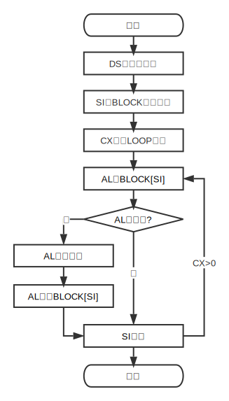
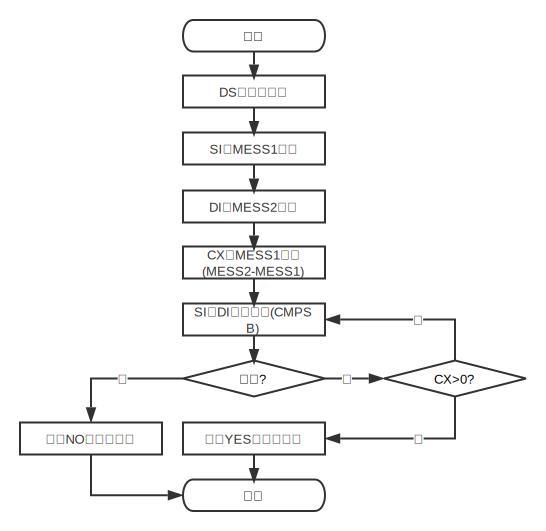
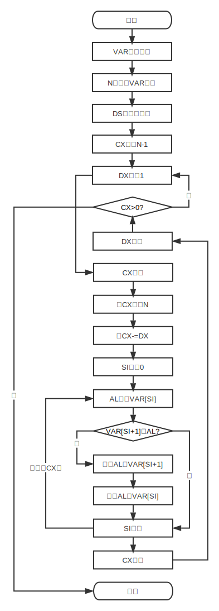
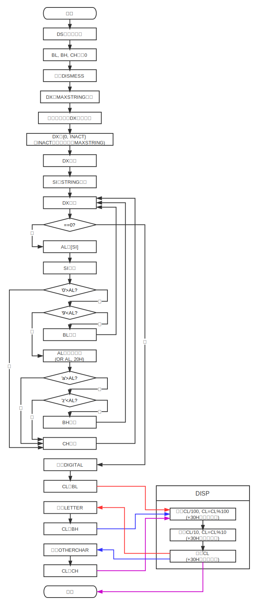
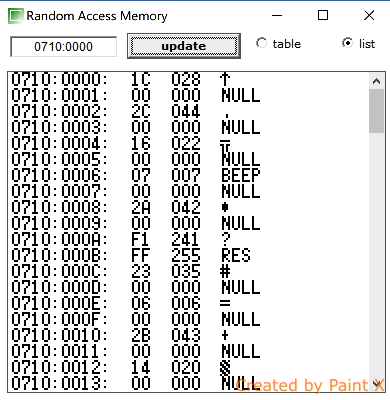
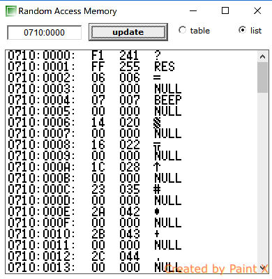

## 流程分析
阅读《计算机组成与接口实验》，选择 4 个例子画出流程图
### 指令系统
设一存储区中存放有10个带符号的单字节数，现要求分别求出其绝对值后存放到原单元中。

```
DATA    SEGMENT
        BLOCK   DB -10,15H,20H,-1,-23,46H,16H,-33,65H,88H
        DATA    ENDS
CODE    SEGMENT
        ASSUME DS:DATA, CS:CODE
START:  MOV     AX, DATA
        MOV     DS, AX
        MOV     SI, OFFSET  BLOCK
        MOV     CX, 10
AGAIN:  MOV     AL, [SI]
        TEST    AL, 80H     ;测试是否为正数
        JZ      NEXT
        NEG     AL          ;求负数的绝对值
        MOV     [SI], AL
NEXT:   INC     SI
        LOOP    AGAIN
        MOV     AH, 4CH     ;返回DOS
        INT     21H
CODE    ENDS
        END     START
```


比较两个字符串 MESS1 和 MESS2 所含字符是否完全相同，若相同则显示‘MATCH’，若不同则显示‘NO MATCH’ 。

```
DATA     SEGMENT
MESS1    DB   'I AM A TEACHER.'
MESS2    DB   'I AM A TEACHAR.'
YES      DB   'MATCH', 0DH, 0AH, '$'
NO       DB   'NO MATCH', 0DH, 0AH, '$'
DATA     ENDS
CODE     SEGMENT
         ASSUME CS:CODE, DS:DATA
START:   MOV    AX, DATA
         MOV    DS, AX
BEGIN:   LEA    SI, MESS1
         LEA    DI, MESS2
         MOV    CX, MESS2- MESS1
         REPE   CMPSB
         JNE    DISPNO
         LEA    DX, YES
         MOV    AH, 9
         INT    21H
         MOV    AH, 4CH
         INT    21H
DISPNO:  LEA    DX, NO
         MOV    AH, 9
         INT    21H
         MOV    AH, 4CH
         INT    21H
CODE     ENDS
         END    START
```



### 汇编语言编程
将一组有符号存储字节数据按从小到大的顺序排列。设数组变量为VAR，数组元素个数为 N。

```
    D       SEGMENT
  VAR       DB -1, -10, -100, 27H, 0AH, 47H
    N       EQU $-VAR
    D       ENDS
    C       SEGMENT
            ASSUME CS: C, DS:D
    B:      MOV AX, D
            MOV DS, AX
            MOV CX, N-1
            MOV DX, 1
   AG:      CALL SUBP
            INC DX
            LOOP AG
            MOV AH,4CH
            INT 21H
            SUBP PROC
            PUSH CX
            MOV CX, N
            SUB CX, DX
            MOV SI, 0
RECMP:      MOV AL, VAR[SI]
            CMP AL, VAR[SI+1]
            JLE NOCH
            XCHG AL, VAR[SI+1]
            XCHG AL, VAR[SI]
 NOCH:      INC SI
            LOOP RECMP
            POP CX
            RET
 SUBP       ENDP
    C       ENDS
            END B
```



### 接口技术
利用 DOS 系统功能调用，从键盘输入一串字符，分别统计字母、数字和其他 字符的个数，并输出显示统计结果。

```
DATA       SEGMENT 
MAXSTRING  DB   100 
INACT      DB   DUP(0)   
STRING     DB   100 
DISMESS    DB   'PLEASE ENTER A STRING:',0AH,0DH,'$' 
DIGITAL    DB   'DIGITAL IS:','$' 
LETTER     DB   'LETTER IS:','$' 
OTHERCHAR  DB   'OTHER IS:','$' 
CRLF       DB   0AH,0DH,'$' 
DATA       ENDS 
CODE       SEGMENT 
           ASSUME CS:CODE,DS:DATA 
MAIN       PROC   FAR 
           MOV    AX,DATA 
           MOV    DS,AX 
           MOV    BL,0 
           MOV    BH,0 
           MOV    CH,0 
DISPSTRING MACRO 
           MOV    AH,9 
           INT    21H 
           ENDM 
DISPCHAR   MACRO 
           MOV    AH,2 
           INT    21H 
           ENDM 
           LEA    DX,DISMESS 
           DISPSTRING 
BEGIN:     LEA    DX,MAXSTRING 
           MOV    AH,0AH 
           INT    21H
           MOV    DL,INACT 
           MOV    DH,0
           INC    DX
           LEA    SI,STRING 
REPEAT:    DEC    DX
           JZ     ENDCHE 
           MOV    AL,[SI] 
           INC    SI 
           CMP    AL,'0' 
           JB     OTHER 
           CMP    AL,'9' 
           JA     NEXT1 
           INC    BL 
           JMP    REPEAT 
NEXT1:     OR     AL,20H 
           CMP    AL,'a' 
           JB     OTHER 
           CMP    AL,'z' 
           JA     OTHER 
           INC    BH 
           JMP    REPEAT 
OTHER:     INC    CH 
           JMP    REPEAT 
ENDCHE:    LEA    DX,DIGITAL 
           DISPSTRING 
           MOV    CL,BL 
           CALL   DISP 
           LEA    DX,LETTER 
           DISPSTRING 
           MOV    CL,BH 
           CALL   DISP 
           LEA    DX,OTHERCHAR 
           DISPSTRING 
           MOV    CL,CH 
           CALL   DISP 
           MOV    AH,4CH 
           INT    21H 
MAIN       ENDP 
DISP       PROC   NEAR 
           MOV    AL,CL 
           MOV    AH,0 
           MOV    CL,100 
           DIV    CL 
           MOV    CL,AH 
           MOV    DL,AL 
           ADD    DL,30H 
           DISPCHAR 
           MOV    AL,CL 
           MOV    AH,0 
           MOV    CL,10 
           DIV    CL 
           MOV    CL,AH 
           MOV    DL,AL 
           ADD    DL,30H 
           DISPCHAR 
           MOV    DL,CL 
           ADD    DL,30H 
           DISPCHAR 
           LEA    DX,CRLF 
           DISPSTRING 
           RET 
DISP       ENDP 
CODE       ENDS 
           END    MAIN
```



## X86汇编实现快速排序
运行环境为emu8086。

### 选题的考虑
快速排序包含了递归（运用栈）、分支（运用条件跳转）、数据交换（运用寄存器、存储器的操作）等过程，可通过在运行时观察emu8086的寄存器、内存的值更直观体会X86取指、读寄存器、执行、存储器访问、分支、写回等流程，也利于进一步认识X86汇编的特性和语法规则。

### 设计思路
算法流程描述（C语言风格）。

```
void swap(int array[], int left, int right)
{
    int temp = array[left];
    array[left] = array[right];
    array[right] = temp;
}

int quicksort(int array[], int left, int right)
{
    int pivot = left;
    while (right > left)
    {
        while (right > pivot)
        {
            if (array[right] >= array[pivot])
                --right;
            else
            {
                swap(array, pivot, right);
                pivot = right;
                break;
            }
        }
        while (left < pivot)
        {
            if (array[left] <= array[pivot])
                ++left;
            else
            {
                swap(array, left, pivot);
                pivot = left;
                break;
            }
        }
    }
    return pivot;
}

void recursion(int array[], int left, int right)
{
    if (left < right)
    {
        int pivot = quicksort(array, left, right);
        recursion(array, left, pivot - 1);
        recursion(array, pivot + 1, right);
    }
}

#include <stdio.h>

int main()
{
    int array[] = {28, 44, 22, 7, 42, -15, 35, 6, 43, 20};
    recursion(array, 0, 9);
    // for (int i = 0; i < 10; ++i)
    //     printf("%d ", array[i]);
    // printf("\n");
    return 0;
}
```
接着尝试将C语言代码逐句（并不一定顺序全都相同，比如代码模块顺序就不同了）转换成X86汇编。

```
DATA        SEGMENT
;int array[] = {28, 44, 22, 7, 42, -15, 35, 6, 43, 20};
ARR         DW     28, 44, 22, 7, 42, -15, 35, 6, 43, 20
DATA        ENDS

CODE        SEGMENT
            ASSUME CS: CODE, DS: DATA

START:      MOV    AX,  DATA
            MOV    DS,  AX

            ;recursion(array, 0, 9);
            MOV    BX,  0
            MOV    CX,  9
            CALL   RECURSION
            
            ;terminated
            MOV    AX,  4C00H
            INT    21H

;recursion(int array[], int left, int right)
;AX pivot, BX left, CX right
RECURSION   PROC

            ;if (left < right)
            CMP    BX,  CX
            JGE    RET1
             
            ;int pivot = quicksort(array, left, right);
            PUSH   CX
            PUSH   BX
            CALL   QUICKSORT
            
            ;recursion(array, left, pivot - 1);
            POP    BX
            PUSH   AX
            MOV    CX,  AX
            DEC    CX
            CALL   RECURSION

            ;recursion(array, pivot + 1, right);
            POP    AX
            POP    CX
            MOV    BX,  AX
            INC    BX
            CALL   RECURSION

RET1:       RET
RECURSION   ENDP

;int quicksort(int array[], int left, int right)
;AX pivot, BX left, CX right
QUICKSORT   PROC

            ;int pivot = left;
            MOV    AX,  BX

;while (right > left)
WHILE1:     CMP    BX,  CX
            JB     WHILE2

            ;return pivot
            RET

;while (right > pivot)
WHILE2:     CMP    AX,  CX
            JAE    WHILE3

            ;if (array[right] >= array[pivot])
            MOV    SI,  AX
            SHL    SI,  1
            MOV    DX,  [ SI ]
            MOV    SI,  CX
            SHL    SI,  1
            CMP    DX,  [ SI ]
            JG     ELSE2

            ;--right;
            DEC    CX
            JMP    WHILE2

;else
ELSE2:      ;swap(array, pivot, right);
            MOV    SI,  AX
            SHL    SI,  1
            MOV    DX,  [ SI ]
            MOV    SI,  CX
            SHL    SI,  1
            XCHG   DX,  [ SI ]
            MOV    SI,  AX
            SHL    SI,  1
            MOV    [ SI ],  DX

            ;pivot = right
            MOV    AX,  CX
            
            ;break

;while (left < pivot)
WHILE3:     CMP    BX,  AX
            JGE    WHILE1

            ;if (array[left] <= array[pivot])
            MOV    SI,  BX
            SHL    SI,  1
            MOV    DX,  [ SI ]
            MOV    SI,  AX
            SHL    SI,  1
            CMP    DX,  [ SI ]
            JG     ELSE3

            ;++left
            INC    BX
            JMP    WHILE3

;else
ELSE3:      ;swap(array, left, pivot)
            MOV    SI,  BX
            SHL    SI,  1
            MOV    DX,  [ SI ]
            MOV    SI,  AX
            SHL    SI,  1
            XCHG   DX,  [ SI ]
            MOV    SI,  BX
            SHL    SI,  1
            MOV    [ SI ], DX 

            ;pivot = left
            MOV    AX,  BX

            ;break
            JMP    WHILE1

QUICKSORT ENDP
    
CODE        ENDS
            
            END    START
```
### 结果


运行开始时，数据为 {28, 44, 22, 7, 42, -15, 35, 6, 43, 20}



运行结束时，数据为 {-15, 6, 7, 20, 22, 28, 35, 42, 43, 44}

### 实现体会
1. X86的寄存器各有用途，如CX寄存器用于LOOP计数、SI为栈顶指针等等；
2. X86源操作数与目的操作数不可同时为存储单元；
3. 有多种跳转指令，其中要注意条件有无符号数；
4. emu8086仿真器非常方便debug，比如可通过SS对应的内存单元查看数据段。